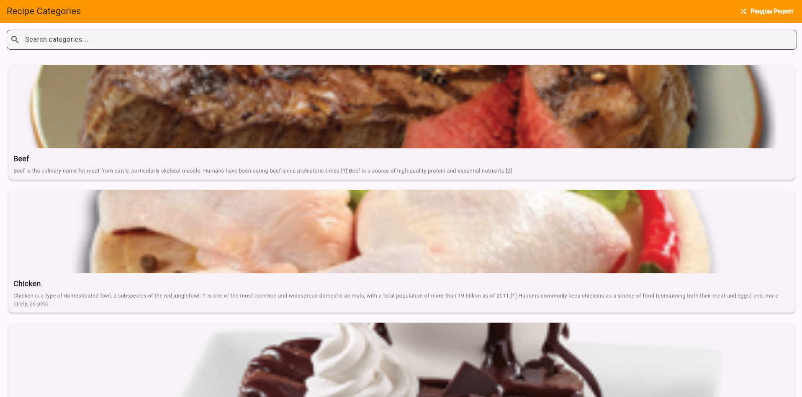
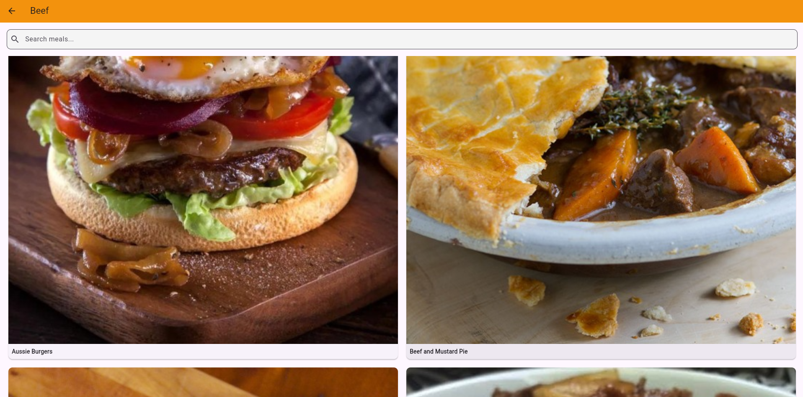
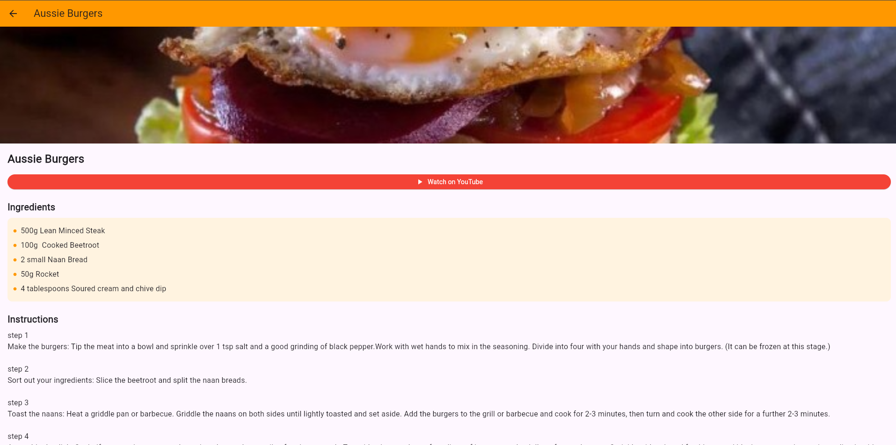
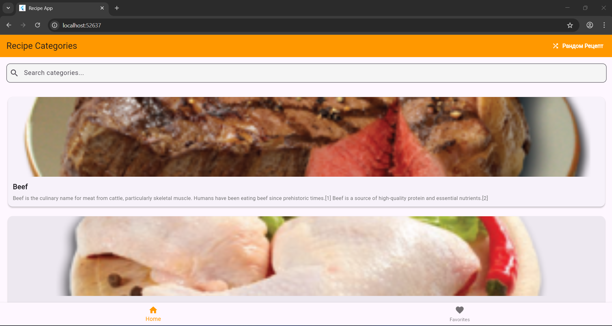
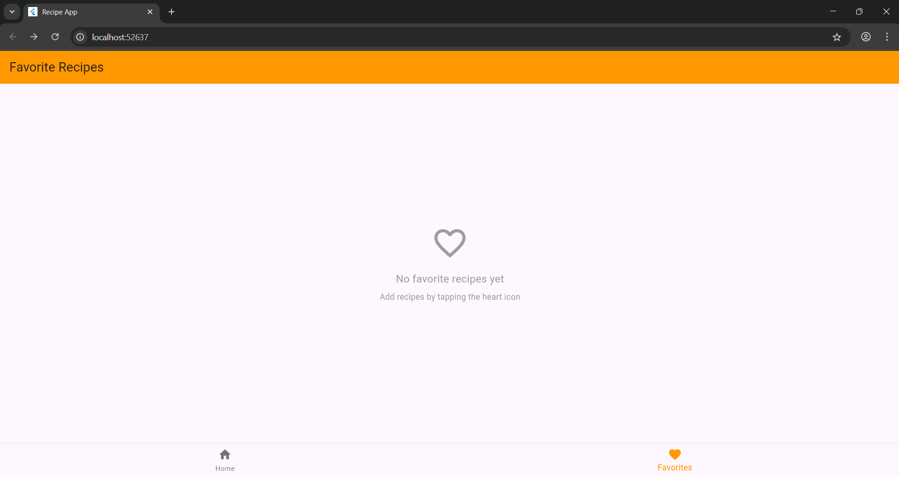

# Recipe App - Апликација за Рецепти (Web Version)

Web апликација за прикажување на рецепти развиена во Flutter со користење на TheMealDB API.

## Опис

Оваа апликација овозможува:
- Преглед на категории на јадења
- Пребарување на категории и јадења
- Детален приказ на рецепти со состојки и инструкции
- Рандом рецепт на денот
- YouTube видео линкови за подготовка
- **НОВО (Lab 3):** Додавање рецепти во омилени
- **НОВО (Lab 3):** Дневни нотификации за рецепт на денот
- **НОВО (Lab 3):** Firebase интеграција

## Screenshots

### Почетен екран со категории

### Листа на јадења

### Детален приказ на рецепт

## ЛАБ 3 СЛИКИ 

### Омилени рецепти

